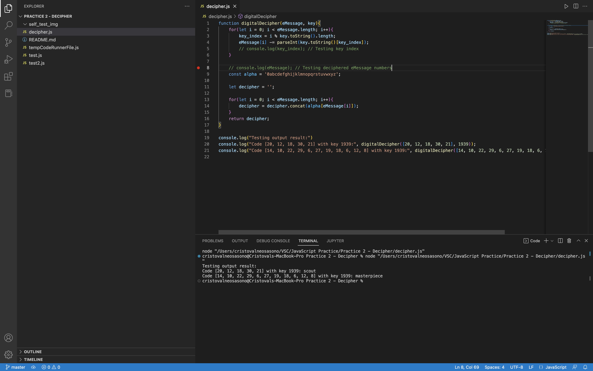

Made by: L1BC_Cristoval Neo Sasono_2602158235

# Running the Code

This JavaScript code can be run  directly through the computer terminal or the terminal within an IDE like VSC after downloading the extension 'Code Runner'.

[IMPORTANT: Make sure that Node.js is installed in your device.]

Once node is installed, open your terminal and type: node [file address]

# Self Test 

My result from the terminal:

